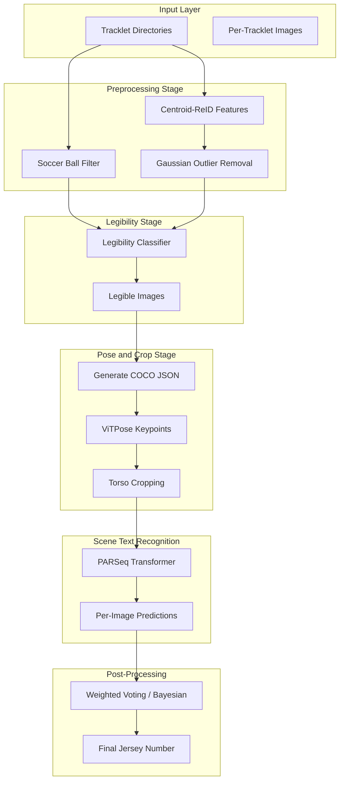
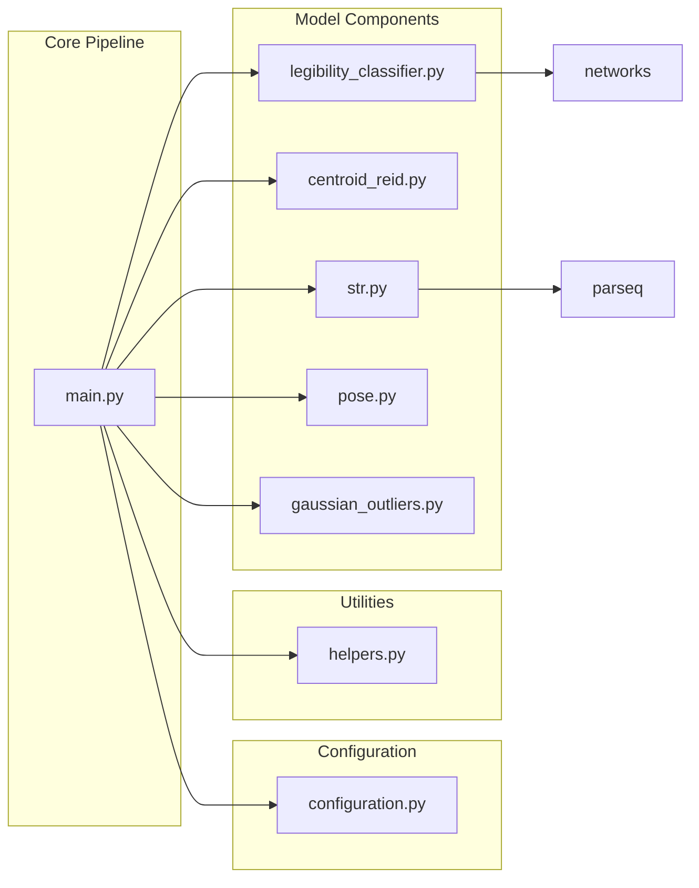

# Jersey Number Recognition - Architecture

## Overview

The project implements an end-to-end pipeline for **jersey number recognition** in sports videos (SoccerNet and Hockey datasets). It combines multiple deep learning components: legibility classification, ReID feature extraction, pose estimation, torso cropping, and scene text recognition (STR).

## Pipeline Architecture



## Component Dependency Graph



## File Inventory and Purposes

| File | Purpose |
|------|---------|
| `main.py` | Pipeline orchestrator; entry point `python main.py <dataset> <part>` |
| `configuration.py` | Paths, model URLs, conda env names (vitpose, parseq2, centroids) |
| `helpers.py` | Pose JSON generation, torso cropping, prediction consolidation, evaluation |
| `legibility_classifier.py` | Binary legibility classification (ResNet18/34 or ViT-B/16) |
| `centroid_reid.py` | ReID feature extraction via Centroid-ReID (ResNet50) |
| `str.py` | PARSeq STR wrapper; inference and temperature scaling |
| `pose.py` | ViTPose wrapper for keypoint detection |
| `gaussian_outliers.py` | Gaussian-based outlier removal for tracklet images |
| `networks.py` | Legibility and jersey number classifier architectures |
| `jersey_number_dataset.py` | PyTorch datasets for legibility and number classification |
| `number_classifier.py` | Alternative ResNet34-based classifier (non-STR) |
| `data.py` | SoccerNet dataset downloader |
| `setup.py` | Environment setup, model downloads, dependency cloning |

## External Dependencies (Cloned Repos)

- **str/parseq/** - PARSeq transformer for STR
- **pose/ViTPose/** - ViTPose pose estimation
- **reid/centroids-reid/** - Centroid-ReID
- **sam2/** - Sharpness-Aware Minimization optimizer

## Data Flow

### SoccerNet Pipeline

```
Tracklets → Ball Filter + ReID → Outliers → Legibility → Pose → Crops → PARSeq → Consolidate → Final
```

### Intermediate Data Formats

**Input:**
- Tracklet structure: `{tracklet_id}/image_*.jpg`
- Ground truth: JSON `{tracklet_id: jersey_number}`

**Intermediate:**
- Features: `{tracklet_id}_features.npy` (N×256)
- Legibility: `legible.json` `{tracklet_id: [image_paths]}`
- Pose: `pose_results.json` `{pose_results: [{img_name, keypoints}]}`
- Crops: `crops/imgs/{image_name}.jpg`

**Output:**
- Predictions: `jersey_id_results.json` `{image_name: {label, confidence, raw, logits}}`
- Final: `final_results.json` `{tracklet_id: jersey_number}`
